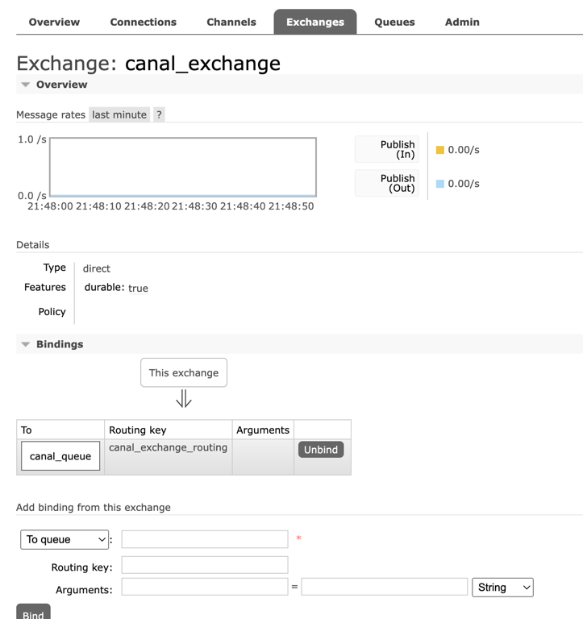
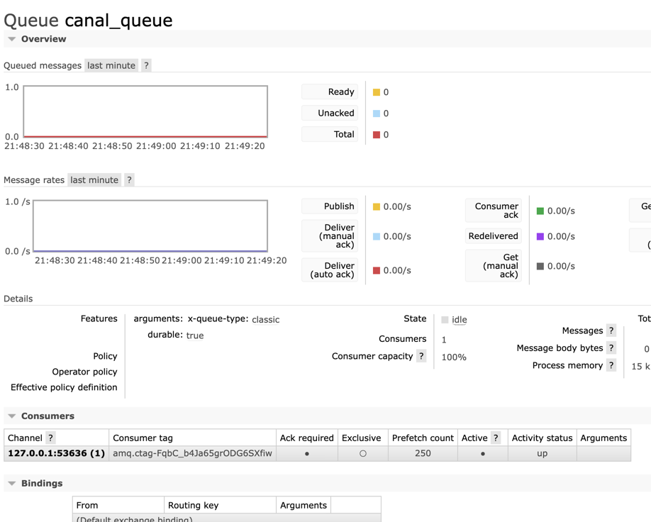

### mysql创建canal用户
```sql
set global validate_password_length=4;
set global validate_password_policy=0;
CREATE USER 'canal' IDENTIFIED BY '1391086179xl..';
grant select,replication slave, replication client on *.* to 'canal'@'%' identified by 'canal';
```

### mysql配置
```text
[root@iZ2zei01n7f2wre8skwlipZ ~]# cat /etc/my.cnf
# For advice on how to change settings please see
# http://dev.mysql.com/doc/refman/5.7/en/server-configuration-defaults.html

[mysqld]
#
# Remove leading # and set to the amount of RAM for the most important data
# cache in MySQL. Start at 70% of total RAM for dedicated server, else 10%.
# innodb_buffer_pool_size = 128M
#
# Remove leading # to turn on a very important data integrity option: logging
# changes to the binary log between backups.
#########关注这里##########
log_bin=mysql-bin
server_id=1
binlog-format=ROW # 选择 ROW 模式
binlog-do-db=cas_blog #指定数据库级别为ROW，不指定则为所有
#########关注这里##########
#
# Remove leading # to set options mainly useful for reporting servers.
# The server defaults are faster for transactions and fast SELECTs.
# Adjust sizes as needed, experiment to find the optimal values.
# join_buffer_size = 128M
# sort_buffer_size = 2M
# read_rnd_buffer_size = 2M
datadir=/var/lib/mysql
socket=/var/lib/mysql/mysql.sock

# Disabling symbolic-links is recommended to prevent assorted security risks
symbolic-links=0

log-error=/var/log/mysqld.log
pid-file=/var/run/mysqld/mysqld.pid
```

### canal对接mq



    1、首先要安装好canal和mq的运行环境
    2、新建交换机和队列，2个用户名并配置vhsot
    3、更改canal.properties中的
```text
# tcp, kafka, rocketMQ, rabbitMQ
canal.serverMode = rabbitMQ
...
##################################################
######### 		    RabbitMQ	     #############
##################################################
rabbitmq.host = 127.0.0.1
rabbitmq.virtual.host = /
rabbitmq.exchange = canal_exchange
rabbitmq.username = canal
rabbitmq.password =canal
rabbitmq.deliveryMode =
``` 
    4、更改instance.properties中的
```text
...
# username/password
canal.instance.dbUsername=canal
canal.instance.dbPassword=canal
...
# mq config
canal.mq.topic=canal_exchange_routing
```

### 启动canal
    sh canal/bin/start.sh
    
### mq消费消息
    DirectReceiver消费者收到消息  : {"data":[{"id":"1","counter":"23","update_time":"2022-03-05 21:45:39"}],"database":"cas_blog","es":1646487939000,"id":17,"isDdl":false,"mysqlType":{"id":"varchar(32)","counter":"int(11)","update_time":"datetime"},"old":null,"pkNames":["id"],"sql":"","sqlType":{"id":12,"counter":4,"update_time":93},"table":"cas_canal_counter_up","ts":1646487939151,"type":"INSERT"}   
    
### 效果
    非常好，能更具增量变化更新缓存中的数据，实时性高。此代码没做失败补偿。
    